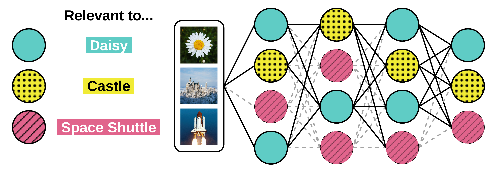

# Analyzing the Efficiency of Class-Aware Pruning


## Project Overview

This project is building on our [previous work](https://github.com/sm1lla/ClassAwarePruning) on Class-Aware Pruning and
is the accompanying code to our paper Analyzing the Efficiency of Class-Aware Pruning.



This work evaluates class-aware and traditional pruning techniques using two widely used model architectures (ResNet-18, VGG-16) and various 
data subsets, comparing them across a range of metrics, including accuracy, FLOPs savings, inference latency, and
model size. 

### Pruning Techniques

- **Magnitude**: Unstructured global magnitude pruning that sets weights to zero based on lowest magnitudes 
- **OCAP** (`filter_selection/ocap.py`): Computes activation statistics via forward hooks, applies ratios per-layer -> Based on https://github.com/mzd2222/OCAP
- **LRP** (`filter_selection/lrp.py`): Layer-wise Relevance Propagation; uses backpropagation to compute relevance scores -> Based on https://github.com/seulkiyeom/LRP_Pruning_toy_example
- **L1-Norm**: Prunes by removing the weights with lowest sum of absolute values.
- **Taylor**: Wraps torch_pruning library with Taylor/APoZ attribution metrics -> Used https://github.com/marcoancona/TorchPruner

| Algorithm | Structured | Class-aware | Data-based | Scope  |
|------------|------------|------------|------------|--------|
| Magnitude  | No         | No         | No         | Global |
| L1-Norm    | Yes        | No         | No         | Layer  |
| Taylor     | Yes        | No         | Yes        | Global |
| LRP        | Yes        | Yes        | Yes        | Global |
| OCAP       | Yes        | Yes        | Yes        | Layer  |

All pruning strategies inherit from `PruningSelection` abstract base and implement `select(model)` → dict of layer masks/indices.
In the case of unstructured pruning (Magnitude), selection and pruning are combined to one singular step, since setting weights to
zero does not require structural change in model architecture.

### Metrics

We measure accuracy, batch inference latency, FLOPs for a forward pass, model size on disk, pruning distribution per layer, and
preparation overhead in the form of time spent on pruning and retraining.

### Data Subsets (based on ImageNet)

- **Similar**: Pirate ship, Ocean liner, Catamaran, Gondola, Lifeboat, Speedboat, Canoe, Schooner, Fireboat, Trimaran.
- **Distinct**: Daisy, Castle, Space shuttle, Guacamole, Jellyfish, Abacus, Alp, Triceratops, King penguin, Website.

## Key Files

| File             | Purpose                                                                                                                |
|------------------|------------------------------------------------------------------------------------------------------------------------|
| `main.py`        | Orchestrates full pipeline: training → selection → pruning → retraining → evaluation                                   |
| `experiments.py` | Main file for runnning multiple evaluations experiments in one go                                                      |
| `selection.py`   | Abstract base `PruningSelection` and all filter selection algorithms                                                   |
| `pruner.py`      | `DepGraphPruner` applies selected indices via torch.fx symbolic trace and `StructurePruner` implements a similar logic. |
| `models.py`      | Model factory; handles torchvision load, last-layer replacement                                                        |
| `data_loader.py` | `DataLoaderFactory` subclasses for CIFAR10/ImageNet/GTSRB                                                              |
| `metrics.py`     | Accuracy, inference time, parameter ratio, FLOP counting                                                               |
| `config/...`     | Hydra YAML configs (base, pruning strategies, models, datasets)                                                        |


## Usage

### Core Pipeline (main.py → main())

1. **Configuration Loading**: Hydra config system loads dataset, model, pruning, and training parameters from `config/`.
2. **Model Loading**: `models.get_model()` retrieves torchvision models and adjusts output layers.
3. **Data Preparation**: `DataLoaderFactory` subclasses create train/test/pruning subset loaders.
4. **Selection Phase**: `selection.get_selector()` factory returns pruning strategy instance that selects filters.
5. **Pruning Phase**: `DepGraphPruner` applies selected pruning of selected filter indices via torch.fx symbolic tracing.
6. **Evaluation**: `metrics.measure_inference_time_and_accuracy()` measures per-class accuracy and inference time.


### Pruning a Pretrained Model
Example - Pruning a VGG16 model trained on ImageNet with OCAP to 85% pruning ratio for classes 10,20,30: 
```bash
python main.py model=vgg16 dataset=imagenet training.train=false model.pretrained_weights_path=<PATH_TO_PRETRAINED_WEIGHTS>\
pruning=ocap \
pruning.pruning_ratio="[0.85]" selected_classes=[10,20,30] 
```
Further parameters can be adjusted in the config files or via CLI overrides.

### Running experiments
Example - Run experiment for evaluating unstructured magnitude pruner on the distinct subset:
```bash
python -u experiments.py --experiment 1 --execute
```
A list of available experiments can be found in `experiments.py`
All metrics are printed to console. If log_results=true, results are also saved logged to Weights & Biases.

## Project-Specific Patterns & Conventions

### Hydra Configuration
- **Override pattern**: CLI args override YAML (e.g., `training.retrain_after_pruning=true`)
- **Config locations**: `config/{pruning,model,dataset}/*.yaml` + `config/config.yaml` base

### Pruning
- **Skip early layers**: `cfg.model.skip_first_layers` bypasses pruning first N conv layers as these are critical for feature extraction
- **Dealing with Skip Connection in ResNet**: `filter_pruning_indices_for_resnet()` in `helpers.py` is called for ResNets to ensure compatible pruning of skip connections (we don't prune the last conv layer in a block). If other archtitectures with skip connections are used, similar logic must be implemented
- **Last Layer Replacement**: When `replace_last_layer=true`, linear output layer is replaced so output dimension matches number of `selected_classes`
